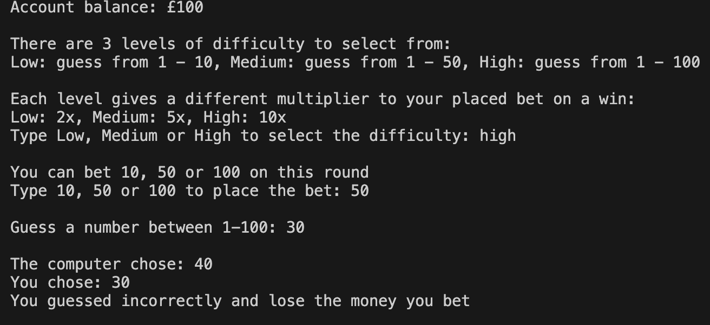

# Casino-Number-Guess

Welcome to the Casino-Number-Guess repository! This repository serves the purpose of practicing/ learning C++.
This project was created using C++ only!

# About 

This project was inspired by the project ideas for C++ at [GeeksForGeeks 50 project ideas](https://www.geeksforgeeks.org/top-50-cpp-project-ideas-for-beginners-advanced/#beginner-level-c-projects-ideas) - The casino game at number 3 of their list.

# Specification

The prompt given by GeeksForGeeks was quite sparse:
- Use computer to generate a random number
- Get player to guess the random number
- Player gets money for guessing correctly
- Create varying difficulty of the game
- Award "Money" to player when they win 
- Amount of money should depend on the difficulty of the game

# Features

This section essentially lists what was specified by GeeksForGeeks with more details on what was actually included in the final rendition.

The project was formated using the text and taking user input in the console.

- In game balance to make bets with, starting at 100
- 3 levels of difficulty (that can be changed each round): Low, Medium and High
- Higher levels of difficulty increases the range of numbers that could be selected: Low 1-10, Medium 1-50, High 1-100
- The incentive for choosing a higher difficulty is a higher multiplier bonus on your winnings: Low 2x, Medium 5x, High 10x
- Bets can be made in increments of 10, 50 or 100 depending on your balance
- The game ends when your balance goes below 10

# Results

Below is a demonstration of a single game with 6 rounds played:

Round 1:

Round 2:

Round 3:

Round 4:

Round 5:

Round 6:

# Findings

Due to the games lack of complexity and questionable balancing, it was found to be quite boring after testing. 
Most frequently, you would lose every round even on the lowest difficulty until you ran out of money.

To improve the game, more balancing surrounding the multipliers of higher difficulties should be implemented (bigger reward for winning the higher difficulty rounds).

# Contributions

1. Start by forking the repository
2. Create a new branch in the forked repository
3. Make any changes you wish
4. Commit and push alterations to the main branch of the forked repository
5. Create a pull request here to get your changes implemented

# License

This project is licensed under the MIT License.